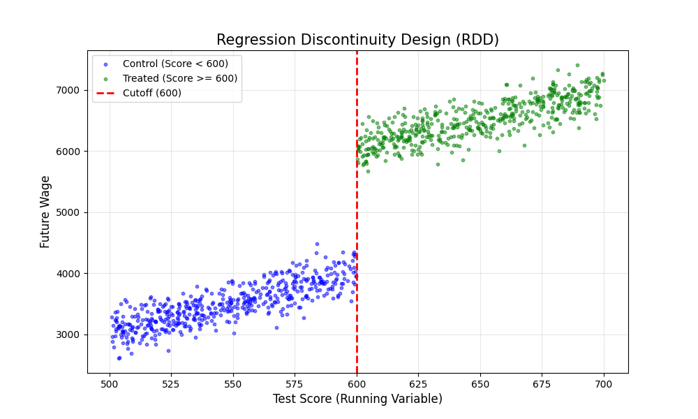

# 第一讲：让回归变得有意义
## 1.重要概念：选择性偏误
下面这个式子为例
$$\underbrace{E[Y_i | D_i=1] - E[Y_i | D_i=0]}_{\text{我们观测到的差异}} = \underbrace{E[Y_{1i} - Y_{0i} | D_i=1]}_{\text{处理组的平均因果效应 (ATT)}} + \underbrace{E[Y_{0i} | D_i=1] - E[Y_{0i} | D_i=0]}_{\text{选择性偏误 (Selection Bias)}}$$
这里强调一下ATT（处理组的平均因果效应）和选择性偏误的区别：
如果我们研究的是吃药对身体健康程度的影响，可以做如下的定义：
ATT:如果你吃了药，比你如果不吃药，好了多少？（这是药效）。
选择性偏误：药的那群人，如果大家都没吃药，他们的身体底子比没吃药的那群人差多少？（这是本底差异）。**偏误是“人”的区别，不是“药”的区别。偏误是因为本来就是两类人（病人和健康人），所以哪怕都不吃药，结果也不一样。**
还有就是，选择性偏误要和随机误差相区分：
**随机误差 ($\varepsilon$)：像是你用尺子量身高，手稍微抖了一下。有时候偏高，有时候偏低。只要样本够大，这些误差会互相抵消（平均值为0）。它不致命，只会让估计变得模糊（方差变大）。**
**选择性偏误 (Bias)：像是你用一把被截断了一截的尺子量身高，或者你总是挑个子高的人来量。无论你样本多大，你的结果永远是错的，而且错的方向一致。它不会抵消！**
## 2.用线性回归逼近真实的条件期望函数：
对传统OLS的解释：当我们做多元回归 $Y_i = \beta_0 + \beta_1 X_{1i} + \beta_2 X_{2i} + ... + \varepsilon_i$ 时，系数 $\beta_1$ 到底是什么意思？
你想得到 $X_1$（比如：教育）对 $Y$（工资）的纯净影响 $\beta_1$，OLS 实际上自动帮你在做以下三步：
- 第一步：把 $X_1$（教育）作为因变量，去对其他所有控制变量 $X_2, X_3...$（如智商、家庭背景）做回归。
- 第二步：算出残差 $\tilde{X}_{1}$。这个残差代表了：“剥离了智商和家庭背景后，剩余的、独立的教育变化”。
- 第三步：把 $Y$ 对这个残差 $\tilde{X}_{1}$ 做单变量回归。顿悟时刻：多元回归的系数 $\beta_1$，从来不是简单的相关性。它是利用 $X_1$ 中无法被其他变量解释的“剩余变异”来解释 $Y$。这就是为什么我们说回归能“控制”混淆变量——它在数学上把混淆变量的影响从 $X_1$ 中“剔除”出去了。
- 在劳动经济学和很多政策评估中，我们关心的关系大多是单调的（Monotonic），而不是 U 型的。
  - 例子：受教育年限（$X$） vs 工资（$Y$）。
  - 真相：这通常是一条弯曲的上升曲线（凹函数）。
  - 读完小学的回报率极高，读完博士的回报率可能边际递减。它虽然不是直线，但它一直都在往上走。在这种情况下，用直线拟合会有什么后果？
  - 直线虽然不能完美覆盖曲线，但直线的斜率 $\beta$ 会穿过这堆数据。安格里斯特的“加权平均”理论：此时，**OLS 算出的那个 $\beta$，本质上是所有不同教育阶段回报率的加权平均值**。它告诉你：“平均而言，多读一年书能多赚 10%。”这对于政策制定已经足够了！ 我们不需要知道读博士具体赚多少、读小学具体赚多少，我们需要一个***高度概括的数字*** 来判断教育是否有用。总结：只要不是 U 型反转，直线就能提供一个非常棒的“平均因果效应”摘要。

**Q:为什么非线性的真实因果关系能够被线性回归逼近？**
假设真实的条件期望函数是非线性的，比如 $E[Y|X] = \alpha + \beta X + \gamma X^2$。虽然这个函数是非线性的，但我们可以通过在回归中加入 $X^2$ 作为一个额外的解释变量，来捕捉这种非线性关系。这样，我们的回归模型变成：
$$Y_i = \beta_0 + \beta_1 X_i + \beta_2 X_i^2 + \varepsilon_i$$
通过这种方式，线性回归模型可以灵活地适应非线性的关系，从而更准确地估计因果效应。
# 第二讲：遗漏变量偏误（OVB formula）
我们有两个回归方程：
长回归（真实世界）：$Y_i = \rho S_i + \gamma A_i + \varepsilon_i$这里 $\rho$ 是我们想要的真理（教育 $S$ 的真实回报）。$\gamma$ 是能力 $A$ 对工资 $Y$ 的影响。
短回归（你的错误模型）：$Y_i = \rho' S_i + u_i$这里 $\rho'$ 是你算出来的系数。OVB 核心公式告诉我们，你算出的 $\rho'$ 实际上等于：$$\rho' = \rho + \underbrace{\gamma \times \delta_{AS}}_{\text{Bias (偏误)}}$$
这里有两个关键部分决定了偏误的方向和大小：
- $\gamma$ (Gamma)：遗漏变量（能力 $A$）对因变量（工资 $Y$）的影响。显而易见，能力强工资高，所以 $\gamma > 0$。
- $\delta_{AS}$ (Delta)：遗漏变量（能力 $A$）和自变量（教育 $S$）的相关性。如果你去跑一个回归 $A_i = \delta_{AS} S_i + ...$，你会发现能力强的人读的书更多，所以 $\delta_{AS} > 0$。结论：$$\text{Bias} = (+) \times (+) = \text{正数}$$所以 $\rho' > \rho$。你以为多读一年书能多赚 20%，其实可能只有 10% 是书带来的，剩下 10% 是因为你本来就聪明。
# 第三讲：解决OVB的思路
### 1.加入控制变量：什么是好的控制变量？
我们先来说什么是坏的控制变量：如果一个变量本身就是被你的核心自变量（$D$）所影响的结果，那么你绝对不能把它当作控制变量放进回归里。但是，**必须把它和多重共线性问题相区分，多重共线性只会引起估计的不精确（增加方差），而不会引起偏误（增加偏差），但是这个会导致最后结果解读出现问题。** 具体例子如下：
 “上大学（$D$）对工资（$Y$）的影响”。
 场景：你担心如果不控制职业，比较就没有意义。毕竟，银行家和清洁工的工资差异巨大。你在回归里加入了“职业类别”作为控制变量（例如：是否是白领）。你想比较的是“同样是白领，上过大学和没上过大学的人，工资差多少”。如果我们控制了“职业”，会让原本正向的教育回报变成什么样？或者说，我们会错过什么？
 我们首先来看这个问题的因果链条：上大学（$D$） $\rightarrow$ 找到好工作（职业 $W$） $\rightarrow$ 赚高工资（$Y$）。如果控制了职业，我们就会把问题变成这个：**“在职业不变的情况下，上大学能多赚多少钱？”** 这就把大学最重要的功能——帮你找到好工作——给强行抹杀掉了。更确切地来说，这个问题可以描述为：
 - **如果我不允许博尔特跑步（控制‘跑步’变量），他的短跑训练还能让他赢比赛吗？答案当然是不能。但这不代表训练没用，而是你把训练起作用的途径给堵死了**

此外，我们在这里还会产生另一个问题——引入新的选择性偏误（Selection Bias）。当控制“职业=白领”时，我们实际上在比较：
$$\text{普通大学生白领} \quad \text{VS} \quad \text{绝顶聪明的非大学生白领}$$
因为对照组（非大学生）的平均能力（$A_i$）异常得高。当做减法时：$Y_{\text{大学}} - Y_{\text{非大学}}$。由于 $Y_{\text{非大学}}$ 被那群“天才”拉得很高，你会发现结果很小，甚至可能是负的！
#### 下面我们给出一个优秀的控制变量的所需条件：只能控制那些在处理（$D$）发生之前就已经确定下来的变量
还是以就业为例，好的控制变量有这些：
- 性别、年龄、种族。
- 父母的收入（因为你上不上大学改变不了你父母过去的收入）。
- 入学前的智商测试成绩。
作用：这些变量能帮你消除偏误，让你比较的人群更相似。
坏的控制变量，则是 **一切会因为上大学而改变甚至以“上大学为前提”** 的变量，主要有下面几点
- 职业（因为是上学后的结果）。
- 现在的居住地（因为上大学可能会让你搬到大城市）。
- 当前的健康状况（如果研究的是医疗对收入的影响）。
**回归分析就像是一个筛子。它滤掉了所有你能看到的干扰因素，希望最后剩下的变异是“随机”的。**
# 第四讲：指定随机性的方法一——工具变量法（IV）和局部平均处理效应(LATE)
- 问题：当兵的人通常收入低（因为当时往往是穷人家的孩子去当兵）。这是选择性偏误。
- 上帝的随机性：美国政府当时搞了个电视直播抽签，根据你的生日决定你是否要服兵役（比如9月14日出生的人必须去，9月15日的人不用去）。
  **显然，此时生日就成为了一个工具变量，用以解决服兵役的人的出身所导致的选择性偏误，理由如下：**
- 首先，生日和出身没有任何关联，生日是完全随机的
- 其次，你的生日不会因为你服了兵役有任何变动
- 第三，生日又是与当兵这件事强关联的，生日只能通过抽签号来影响是否能够服兵役

#### 由此我们可以引出真正的工具变量要求：
1. 相关性 (Relevance/First Stage):
   1. $Cov(Z, D) \neq 0$： 工具变量 $Z$ 必须确实能影响处理变量 $D$。如果 $Z$ 推不动 $D$，那它就是“弱工具变量”，这会导致估计结果非常不稳定。
2. 排他性约束 (Exclusion Restriction):
   1. $Cov(Z, \varepsilon) = 0$这是最难验证的一条。它意味着 $Z$ 对 $Y$ 的影响必须完全通过 $D$ 来实现，而不能有其他“后门”直接影响 $Y$。
## 4.1案例研究：我们想研究警察人数 ($D$) 对犯罪率 ($Y$) 的因果影响。
面临问题： 警察多的地方往往犯罪率也高（因为犯罪率高才会派更多警察），存在反向因果。有人建议使用 “市长选举年份” ($Z$) 作为工具变量。理由是：市长为了连任，通常会在选举年增加警力投入（满足相关性）。
**根据一些常识，这个$Z$是违反排他性约束的，理由如下** ：
试想一下，在选举年，市长为了讨好选民，除了增加警察，还会做这些事情：
1. 经济刺激： 可能会增加就业岗位（失业率下降，犯罪率可能下降）。
2. 公共设施： 可能会修好路灯、清理社区垃圾（“破窗理论”，环境改善可能降低犯罪）。
3. 司法干预： 可能会要求法官判决更严厉，或者仅仅是改变了犯罪记录的统计方式。

 **如果上述任何一件事发生了，$Z$（选举年份）就通过别的路径影响了 $Y$（犯罪率）。这些“别的路径”都藏在扰动项 $\varepsilon$ 里。**、
## 局部平均处理效应 (Local Average Treatment Effect, LATE)框架说明
这个框架主要是为了解决这个问题
**当我们使用工具变量时，我们估计出来的 $\beta_{IV}$ 到底是谁的效应？**
是所有人的平均效应吗？（ATE，不是）是那些实际接受处理的人的效应吗？（ATT，通常也不是）**IV 估计出的效应，仅针对那些被工具变量 $Z$ 改变了行为的人。**
我们将人群分为四类（以越战征兵为例，$Z$=抽签号低，$D$=参军）：
- 始终参与者 (Always-takers)： 不管抽签号是多少，我都要去当兵（哪怕我没被抽中，我也会志愿入伍）。
- 永不参与者 (Never-takers)： 不管抽签号是多少，我都不去当兵（我有身体原因豁免，或者我逃跑了）。
- 依从者 (Compliers)： 如果抽中我，我就去；没抽中我，我就不去。（只有这类人的行为被 Z 改变了！）
- 对抗者 (Defiers)： 抽中我我就不去，没抽中我我偏要去。（在经济学中通常假设这类人不存在，这叫单调性假设）。

**《基本无害》的核心结论： IV 估计出来的结果，就是 “依从者 (Compliers)” 的平均处理效应。这就是 LATE。**
### 4.2工具变量与控制变量：通过加入控制变量来确保条件独立性
**我们不需要 $Z$ 绝对随机，我们需要的是 “条件独立性” (Conditional Independence)。**
只要我们在回归方程中控制了家庭收入、父母教育水平、社区房价等变量（记为 $X$），把这些干扰因素从 $\varepsilon$ 中剔除出去。此时，我们只需要争辩：“在家庭背景完全相同的一群人中，那些恰好住在大学旁边的人，除了上学方便 ($D$) 之外，没有其他理由比住得远的人工资 ($Y$) 更高。”如果这个假设成立，IV 依然有效。

#### 思考题：
假设我们找到了一个非常完美的随机变量 $Z$（比如如果你今天出门看到的第一辆车尾号是双数），它绝对满足排他性约束（跟你的工资 $\varepsilon$ 毫无关系）。但是，它跟你的受教育年限 $D$ 的相关性非常非常微弱（几乎为 0，只有极其偶然的情况下才相关）。如果你强行用这个 $Z$ 做 2SLS（两阶段最小二乘法）回归，得到的估计值 $\hat{\beta}_{IV}$ 会怎样？
A) 会非常精确，因为 $Z$ 是完美的随机变量。
B) 会有巨大的标准误，且估计值本身会有巨大的偏差（Bias），甚至比 OLS 的偏差还大。
C) 会等于 0。
#### 基于这道题，我们讲讲关于ATT和LATE的关系们还有这里面的一些数学问题
首先，这题选B，理由如下：
尽管相关性过低会让人觉得数据在图像上可能表现为随机游走，即漫天的散点，但是从数学逻辑上来说，考虑$\hat{\beta}_{IV}$的定义式：
$$\hat{\beta}_{IV} = \frac{Cov(Z, Y)}{Cov(Z, D)}$$
如果 $Z$ 是完全随机的（跟 $Y$ 无关），分子确实趋向于 0。但是！如果 $Z$ 是弱工具变量，意味着分母 $Cov(Z, D)$ 也趋向于 0。$0$ 除以 $0$ 会发生什么？在有限样本中，这会导致估计量极其不稳定（标准误巨大）。更糟糕的是，哪怕 $Z$ 和 $\varepsilon$ 只有一丁点微弱的相关性（在现实数据中很难完全为 0），这个微小的相关性会被微小的分母无限放大。结果是：在弱工具变量下，IV 估计量的偏差往往会向 OLS 的偏差靠拢。 也就是说，你费劲找了个 IV，结果算出来的还是错的，而且你还以为它是对的。
##### 下面我们讲解$\hat{\beta}_{IV}$是如何被推倒出来的，以及该如何解读这个结果
1. IV 估计量的核心公式是这个（别怕，只要看懂这一个就行）：
$$\hat{\beta}_{IV} = \frac{Cov(Z, Y)}{Cov(Z, D)}$$
- 分母 $Cov(Z, D)$： $Z$ 推动 $D$ 走了多远？（第一阶段的力量）
- 分子 $Cov(Z, Y)$： $Z$ 推动 $Y$ 走了多远？（简化形式的力量）
- 结果 $\hat{\beta}_{IV}$： $Y$ 变动幅度 $\div$ $D$ 变动幅度 = $D$ 对 $Y$ 的真实影响。
2. 把 $Y$ 拆开（见证奇迹的时刻）我们要把 $Y$ 的真实身份代进去。假设真实的世界是这样的：$$Y = \beta D + \varepsilon$$($Y$ = 真实影响 $\times$ $D$ + 噪音 $\varepsilon$)
   现在，把这个代入上面的公式分子里：$$\hat{\beta}_{IV} = \frac{Cov(Z, \underbrace{\beta D + \varepsilon}_{这是Y})} {Cov(Z, D)}$$
  根据协方差的分配律（就像乘法分配律一样，$Cov(Z, A+B) = Cov(Z, A) + Cov(Z, B)$），我们可以把它拆成两半：$$\hat{\beta}_{IV} = \underbrace{\frac{Cov(Z, \beta D)}{Cov(Z, D)}}_{\text{第一部分}} + \underbrace{\frac{Cov(Z, \varepsilon)}{Cov(Z, D)}}_{\text{第二部分}}$$
3. 看看这两部分变成了什么
   第一部分（好孩子）：$\beta$ 是个常数，可以提出来。分子分母都有 $Cov(Z, D)$，约分约掉了！$$\frac{\beta \cdot Cov(Z, D)}{Cov(Z, D)} = \beta$$
   第二部分（捣蛋鬼）：$$\frac{Cov(Z, \varepsilon)}{Cov(Z, D)}$$这就是误差项。

4. 公式解读
   $$\text{估计值} = \text{真实值} + \frac{\text{样本中 } Z \text{ 和 } \varepsilon \text{ 的相关性}}{\text{样本中 } Z \text{ 和 } D \text{ 的相关性}}$$
   这里有两个坑，也是你之前觉得“应该是 0”的误区所在：
     - 理论 vs. 现实（样本）：在理论上（上帝视角），如果 $Z$ 完美外生，那么 $Z$ 和 $\varepsilon$ 确实没关系，分子应该是 0。但是在现实数据中（样本），哪怕你掷硬币，$Cov(Z, \varepsilon)$ 也绝不可能完全等于 0。它总会有一点点微小的随机噪音（比如 0.0001）。
     - 分母的锅：如果是弱工具变量，意味着分母 $Cov(Z, D)$ 非常非常小（比如 0.00001）。
  $$\text{误差部分} = \frac{\text{微小的噪音 (0.0001)}}{\text{超级微小的相关性 (0.00001)}} = 10$$
  虽然分子很小，但因为分母更小，这个本来该忽略不计的误差，被放大了 10 倍、100 倍甚至 1000 倍！这就是为什么弱工具变量下，估计值 $\hat{\beta}_{IV}$ 会疯狂偏移真实值 $\beta$，而不是老老实实待在 0 附近。它被那个几乎为 0 的分母给“炸”飞了。
##### 这里就引出了我们要讨论的下一个问题：弱工具变量是一个坑，不能轻易使用，尽管我们别无选择。
##### 下面有一道思考题，我们用这个讲解2SLS里面的基本逻辑
研究香烟价格 ($D$) 对香烟销量 ($Y$) 的影响。为了解决价格内生性，我们用烟草税 ($Z$) 做工具变量。
假如我们在电脑上跑了两个简单的回归（系数）：
- 第一阶段 (First Stage)：看 $Z$ 对 $D$ 的影响。
回归方程：$D = 0.5 Z$(解释：税每增加 1 元，价格增加 0.5 元)
- 简化形式 (Reduced Form)：直接看 $Z$ 对 $Y$ 的影响。
回归方程：$Y = -2 Z$(解释：税每增加 1 元，销量减少 2 包)
请问：根据这两个系数，我们可以推算出 价格 ($D$) 对 销量 ($Y$) 的因果效应 ($\hat{\beta}_{IV}$) 是多少？
A) -1 B) -4 C) -1.5，这题答案是-4
这道题方法上很简单：直接用 
$$\frac{\text{总变化}}{\text{第一步的变化}}$$即可
但是从内在的逻辑上，我们有如下的解释。让我们把这个过程想象成齿轮传动：
- 大齿轮 ($Z$)： 这是我们手里的工具（比如税收）。
- 中齿轮 ($D$)： 这是我们要研究的变量（比如价格）。
- 小齿轮 ($Y$)： 这是最终结果（比如销量）。
现在开始转动齿轮：
  - 第一步（First Stage）：你转动 $Z$ 1 圈，带动 $D$ 转了 0.5 圈。(这就是分母：$Z \rightarrow D$ 的系数)
  - 第二步（Reduced Form）：你观察到，当你转动 $Z$ 1 圈时，最后的 $Y$ 转了 -2 圈。(这就是分子：$Z \rightarrow Y$ 的总系数)
  - 关键推理：请问，$D$ 转 1 圈，会带动 $Y$ 转多少圈？（这不就是我们要算的因果效应 $\beta$ 吗？）
    - 既然 $D$ 转 0.5 圈 $\rightarrow$ $Y$ 转 -2 圈。那么 $D$ 转 1 圈（也就是两倍的量） $\rightarrow$ $Y$ 就会转 $2 \times (-2) = -4$ 圈。数学上就是除法：$$\text{因果效应 } \beta = \frac{\text{总效果 } (Z \rightarrow Y)}{\text{传导效果 } (Z \rightarrow D)} = \frac{-2}{0.5} = -4$$
- 这个东西其实是有学名的，就是瓦尔德估计量（当然这个好像不常用），他只在一种特定条件下起作用：**“刚刚好识别” (Just Identified)**，也就是：**有 1 个内生变量 $D$，手里也正好只有 1 个工具变量 $Z$。**
在别的情况下用这个方法会有过度识别的问题，这个后边再说。再多工具变量的时候，我们一般就用2SLS了。2SLS的基本公式如下：
##### 假设我们想研究：喝水 ($D$) 对健康 ($Y$) 的影响。
这里的问题是，现实中的水里面往往有细菌，我们不想要细菌的影响，只想要纯净水的影响，所以我们利用Z这个过滤器对D进行过滤，分为下面的两个步骤
1. 把 $D$（脏水）里面跟 $Z$（过滤器）有关的“干净部分”提炼出来。我们只看 $Z$ 能解释 $D$ 的那一部分。
   $$D = \pi Z + \nu$$
  然后，我们需要保存预测值（Fitted Values）。这个预测值通常记为 $\hat{D}$。$\hat{D}$ 就是“由于 $Z$ 的变化而导致的 $D$ 的变化”。因为 $Z$ 是干净的（外生），所以由 $Z$ 制造出来的 $\hat{D}$ 也是干净的！
2. 看这杯干净的水 ($\hat{D}$) 对健康 ($Y$) 到底有什么影响。跑下面这个回归：$$Y = \beta \hat{D} + \varepsilon$$ 这里算出来的 $\beta$，就是我们要的 IV 估计量。
##### 多工具变量下的计算方式
**是不是应该分别用 $Z_1$ 算一个 $\beta_1$，用 $Z_2$ 算一个 $\beta_2$，然后求平均值？**
***这是错的！！！！！*** 真正的步骤是下面这么搞得：
- 第一阶段 (First Stage)：超级过滤在单变量时，我们是 $D = \pi Z + \nu$。现在有两个 $Z$，我们就跑一个多元回归 (Multiple Regression)：$$D_i = \pi_0 + \pi_1 Z_{1i} + \pi_2 Z_{2i} + \nu_i$$这就是魔法发生的地方！ OLS 回归会自动计算 $\pi_1$ 和 $\pi_2$ 的系数。重点来了： 假如 $Z_1$（烟草税）对吸烟影响很大，而 $Z_2$（宣传）影响很小，那么 OLS 会自动给 $Z_1$ 一个很大的权重（$\pi_1$ 很大），给 $Z_2$ 一个很小的权重。OLS 会自动寻找 $Z_1$ 和 $Z_2$ 的最佳线性组合，使得这个组合能最大程度地解释 $D$ 的变化。最后，我们生成唯一的预测值 $\hat{D}$：$$\hat{D}_i = \hat{\pi}_0 + \hat{\pi}_1 Z_{1i} + \hat{\pi}_2 Z_{2i}$$你看，不管你有 2 个、10 个还是 100 个工具变量，经过第一阶段的“大熔炉”之后，吐出来的永远只有一个 $\hat{D}$。
- 第二阶段 (Second Stage)：回归依旧
  因为我们手里只有一个 $\hat{D}$。$$Y_i = \alpha + \beta_{2SLS} \hat{D}_i + \varepsilon_i$$这就跟单变量的情况一模一样了！

这里对这种做法做一个解释：
1. 想象你有两个证人：证人 A ($Z_1$)就在案发现场，看得清清楚楚（强 IV）。证人 B ($Z_2$)在两公里外用望远镜看，模模糊糊（弱 IV）。
   1. 如果你分别算再平均： 你强行把高清的证词和模糊的证词混在一起，你的结论会被那个眼神不好的证人带偏，误差（方差）会变大。
   2. 2SLS 的做法（先合成）： 第一阶段回归会自动发现：“哎哟，证人 A 的解释力 ($R^2$) 很强，证人 B 很弱。” 于是它在构造 $\hat{D}$ 时，会给 A 极高的权重，几乎忽略 B。**2SLS 生成的那个 $\hat{D}$，是利用手里所有信息能构造出的、最纯净、最有力的 $D$ 的替身。**
2. 这个方法带来了另外一个好处：过度识别的检验
   1. 当恰好识别的时候，我们没有办法确定工具变量是不是有问题
   2. 但是如果是多个工具变量，我们可以通过检验所计算出的两个参数的符号来确定哪一个是有问题的这就是著名的 Sargan-Hansen J 检验。
        - 原假设 ($H_0$)： 所有的工具变量都是有效的（证词一致）。
        -  结果： 如果 P 值小于 0.05，拒绝原假设 $\rightarrow$ 你的工具变量有问题，模型失效！

##### 下面讲解Sargan-Hansen J 检验的真正操作
**Q：明明最后只有一个${\beta}$,是如何进行比较的？**
**A:不是通过单纯的数值或者符号进行比较，而是进行“残差的比较”**
从直觉上来说，可以这么形容检验的过程：
- 核心直觉：弹簧拉力赛想象一下，真实的 $\beta$（因果效应）是一个固定的点。我们有两个工具变量 $Z_1$ 和 $Z_2$，它们就像两根弹簧，都想把估计值拉向自己认为正确的位置。$Z_1$ 说： “我觉得 $\beta$ 应该是 10！”（如果不理 $Z_2$，单用 $Z_1$ 算出的结果）。$Z_2$ 说： “我觉得 $\beta$ 应该是 50！”（如果不理 $Z_1$，单用 $Z_2$ 算出的结果）。
- 2SLS做了什么？
2SLS 是个和事佬。它根据 $Z_1$ 和 $Z_2$ 的强弱（第一阶段的 $\pi$），找了一个平衡点（加权平均）。
比如，最后 2SLS 给出的结果是 $\beta_{2SLS} = 12$（因为它觉得 $Z_1$ 更可信，离 $Z_1$ 近一点）。
- J 检验在测什么？J 检验测的是：“这个平衡点，有没有把大家‘拉伤’？”
  - 如果 $Z_1$ 要 10，$Z_2$ 要 11，平衡点是 10.5。大家都很舒服，弹簧没有张力 $\rightarrow$ 检验通过（P 值大）。
  - 如果 $Z_1$ 要 10，$Z_2$ 要 50，平衡点是 12。$Z_1$ 挺满意（离 10 很近）。但是 $Z_2$ 非常生气！ 因为 12 离它想要的 50 差太远了！这就产生了巨大的 **“张力”**

而实际上，在电脑软件中，是这么操作的：
- 第一步： 算出那个唯一的 $\beta_{2SLS}$。
- 第二步： 算出模型剩下的残差 (Residuals)，记为 $e$。$$e = Y - \beta_{2SLS} \cdot D$$这个 $e$ 代表了模型“解释不了”的部分。
- 第三步（关键）： 看看工具变量 $Z$ 和这个残差 $e$ 有没有关系！
  - 原理是这样的：如果 $Z_1$ 和 $Z_2$ 都是老实人（外生），它们应该跟误差项 $\varepsilon$ 毫无瓜葛。那么，它们跟估算出来的残差 $e$ 也应该毫无瓜葛（相关性接近 0）。但是，如果 $Z_1$ 和 $Z_2$ 打架了（一个要 10，一个要 50）：最终结果 $\beta=12$。对于 $Z_2$ 来说，这个结果偏差太大了！这种“偏差”会泄露到残差 $e$ 里。结果就是：你会发现 $Z_2$ 和 残差 $e$ 竟然呈现出了显著的相关性！
- J 检验的计算公式（简化版）：我们跑一个辅助回归：$$\text{Regress } e \text{ on } Z_1, Z_2$$看这个回归的 $R^2$（解释力）是不是很大。如果 $R^2$ 很大 $\rightarrow$ 说明 $Z$ 能预测残差 $\rightarrow$ 说明 $Z$ 不干净（或者 $Z$ 之间在打架） $\rightarrow$ 拒绝原假设。

# 第五讲：RDD（断点回归）
## 5.1 RDD试图解决的问题：当上帝用一把刀把人群切开时，会发生什么？
准确来说，我们要探究的就是，60分的人和59分的人到底有没有质的区别？之所以这么说，因为这两批人除了及格与否，剩下的条件基本是一致的，这在局部创造了一个完美的随机试验。我们再用下面的例子说明这个问题：
- 我们要研究 获得“国家奖学金” ($D$) 对 毕业后工资 ($Y$) 的影响。规则是：期末考试总分超过 600分 的人，自动获得奖学金。样本中有三个人：小艾： 考了 601 分（刚过线，拿了奖学金）。小比： 考了 599 分（差一点，没拿奖学金）。小西： 考了 300 分（差得远，没拿奖学金）。**如果我们想算“奖学金”的因果效应，谁是小艾的最佳对照组？**

不难猜到，小比是小艾的最佳对照组。这里我们引出RDD最为核心的假设，这个假设和之前的工具变量法一脉相承：
$$局部随机化 (Local Randomization)。$$
这个概念的定义：在这个极小的邻域内，他们的能力是“连续”的，但他们接受的处理（有没有奖学金）是“跳跃”的。用图像表示，大概是这样的：

RDD最终的结果，就是在$x=600$ 这条线上，蓝色和绿色散点图的截距差。在分类上，RDD又分为精确断点回归（SHARP RDD）和模糊断点回归(FUZZY RDD)。二者的区别主要在于对于规则严格程度上的要求。前者要求分类标准唯一，后者则允许在满足第一条件的情况下，可以不发生这一改变。具体定义如下
- 精确断点回归的要求：规则是铁律： $\ge 600$ 分 必须 拿奖，$< 600$ 分 绝对 没奖。概率上来说就是非零即一。计算方法： 直接算断点右边的平均值减去左边的平均值（实际上是用回归拟合）。
- 模糊断点回归的要求：$\ge 600$ 分 有资格 申请奖学金，但也看你申不申请；$< 600$ 分 原则上 不能拿，但如果你有校长推荐信（走后门），也能拿。所以这就会导致600分不能完全决定拿不拿奖，从概率上来说，过了 600 分的人，拿奖概率变成了 80%（不是 100%），没过 600 分的人，拿奖概率是 5%（不是 0%）。
  - 而对于模糊断点回归，为了尽可能减少这种不确定性，我们引入工具变量
  - 内生变量 ($D$)： 实际拿没拿奖学金。工具变量 ($Z$)： “分数是否超过 600” 这个二值变量。过了 600 分 ($Z=1$) 会极大地增加你拿奖 ($D=1$) 的概率（相关性！）。单纯的“过线”这个动作，除了让你拿奖，不会直接让你工资变高（排他性！——前提是我们在 600 分附近比较）。**模糊断点回归 (Fuzzy RDD) 本质上就是以“过线”为工具变量的 2SLS！**

我们要算的效应，就是：$$\text{因果效应} = \frac{\text{工资的跳跃幅度 (Reduced Form)}}{\text{拿奖概率的跳跃幅度 (First Stage)}}$$

## 5.2 RDD的缺陷：断点在多数情况下会被人为操纵
#### 例子
我们要研究 班级人数 ($D$) 对 成绩 ($Y$) 的影响。根据规定，如果一个年级的人数超过 40人，就必须拆成两个小班（每班 20 人）；如果少于 40 人，就维持一个大班。断点： 40 人。这看起来是个完美的 RDD，对吧？但是，如果家长们 提前知道了这个规则，会发生什么？问题：如果家长知道“超过 40 人就会变成小班（小班教学质量好）”，而现在的年级正好只有 39 人。家长们可能会怎么做？

任何人都会猜到，家长们会通过各种手段强行让人数变成40+，进而让小于四十人的班级数量急剧减少。同时，我们设计断点的初衷，是为了研究除了班级人数这个因素，剩下条件都相同的两批人。但是现在，在右侧的（即40+的班级的学生）人，他们的家长都更好，也就是在计算的断点效应中，除了班级人数造成的影响，还掺杂了家庭出身的影响，从排他性上来说，可以认为班级人数